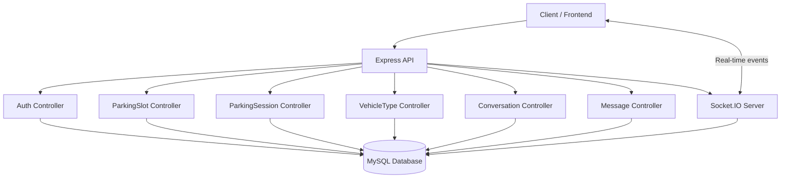

    

```bash
curl -X POST http://localhost:3000/auth/login \
-H "Content-Type: application/json" \
-d '{"email":"user@email.com","password":"123456"}'
```
# 🚗 Vehicle Parking Lot System

## 📋 Project Overview
Vehicle Parking Lot System is a TypeScript-based backend application for managing vehicle parking operations. The system provides real-time parking slot management, user authentication, conversation/messaging capabilities, and AWS CDK infrastructure as code.

- Repository: https://github.com/chukwutem-emi/Vehicle-Parking-Lot-System.
- Author: Chukwutem Stephen Emi.
- Github: [chukwutem-emi](https://github.com/chukwutem-emi)
- License: ISC.
- Language: TypeScript.
- Last Updated: March 12, 2026.


## 🚀 Features

| Feature | Description |
|-------|-------------|
| Authentication | JWT-based user authentication |
| Parking Management | Manage parking slots and sessions |
| Messaging | Real-time messaging with Socket.IO |
| Device Tracking | Track user devices |
| AWS Deployment | Infrastructure with AWS CDK |

##  Project Architectural Diagram

## 🏗️ Project Architecture

### Directory Structure
<details>
<summary> View Full Project Structure </summary>

```bash
Vehicle-Parking-Lot-System/
├── README.md
├── cdk
│   ├── bin
│   │   └── main.ts
│   ├── lib
│   │   ├── backendStack.ts
│   │   ├── endpoints
│   │   │   ├── authEndpoints.ts
│   │   │   ├── parkingSessionEndpoint.ts
│   │   │   ├── parkingSlotEndpoint.ts
│   │   │   └── vehicleTypeEndpoint.ts
│   │   └── lambdas
│   │       ├── authLambdas.ts
│   │       ├── lambdaFactory.ts
│   │       ├── parkingSessionLambda.ts
│   │       ├── parkingSlotLambda.ts
│   │       └── vehicleTypeLambda.ts
│   └── tsconfig.json
├── cdk.json
├── cdk.out
├── models
│   └── index.js
├── package-lock.json
├── package.json
├── seeders
├── src
│   ├── app.ts
│   ├── controllers
│   │   ├── authController
│   │   │   ├── deleteUser.ts
│   │   │   ├── demoteUser.ts
│   │   │   ├── getAllUsers.ts
│   │   │   ├── getUser.ts
│   │   │   ├── login.ts
│   │   │   ├── promoteUser.ts
│   │   │   ├── resetPassword.ts
│   │   │   ├── signup.ts
│   │   │   └── updateUserDetails.ts
│   │   ├── messageController
│   │   │   └── conversation.ts
│   │   ├── parkingSessionController
│   │   │   ├── createParkingSession.ts
│   │   │   ├── getAllParkingSessions.ts
│   │   │   ├── getParkingSession.ts
│   │   │   └── vehicleExitTime.ts
│   │   ├── parkingSlotController
│   │   │   ├── createParkingSlot.ts
│   │   │   ├── fetchParkingSlot.ts
│   │   │   └── updateParkingSlot.ts
│   │   ├── userDeviceController
│   │   │   └── userDevice.ts
│   │   └── vehicleTypesController
│   │       ├── createVehicleType.ts
│   │       ├── fetchVehicleType.ts
│   │       └── updateVehicleType.ts
│   ├── envConfig
│   │   └── env.ts
│   ├── handlers
│   │   ├── auth
│   │   │   ├── createUser.ts
│   │   │   ├── deleteUser.ts
│   │   │   ├── demoteUser.ts
│   │   │   ├── getAllUsers.ts
│   │   │   ├── getUser.ts
│   │   │   ├── login.ts
│   │   │   ├── promoteUser.ts
│   │   │   ├── resetPassword.ts
│   │   │   ├── updatePassword.ts
│   │   │   └── updateUserDetails.ts
│   │   ├── corsHeaders.ts
│   │   ├── lambdaAuth.ts
│   │   ├── model
│   │   │   └── index.ts
│   │   ├── parkingSession
│   │   │   ├── createParkingSession.ts
│   │   │   ├── getAllParkingSession.ts
│   │   │   ├── getParkingSession.ts
│   │   │   └── vehicleExitTime.ts
│   │   ├── parkingSlot
│   │   │   ├── createParkingSlot.ts
│   │   │   ├── fetchParkingSlot.ts
│   │   │   ├── fetchWithID.ts
│   │   │   └── updateParkingSlot.ts
│   │   ├── validation
│   │   │   ├── createPSessionInput.ts
│   │   │   ├── createParkingSlotInputs.ts
│   │   │   ├── createUserInputs.ts
│   │   │   ├── createVehicleTypeInput.ts
│   │   │   ├── fetchVehicleTypeInput.ts
│   │   │   ├── loginInputs.ts
│   │   │   ├── resetPasswordInput.ts
│   │   │   ├── updateParkingSlotInput.ts
│   │   │   ├── updateUserDetailsInput.ts
│   │   │   ├── updateVehicleTypeInputs.ts
│   │   │   └── vehicleExitTimeInput.ts
│   │   └── vehicleType
│   │       ├── createVehicleType.ts
│   │       ├── fetchVehicleType.ts
│   │       └── updateVehicleType.ts
│   ├── middleware
│   │   └── is-auth.ts
│   ├── models
│   │   ├── conversation.ts
│   │   ├── message.ts
│   │   ├── parking-sessions.ts
│   │   ├── parking-slots.ts
│   │   ├── user-devices.ts
│   │   ├── user.ts
│   │   └── vehicle-types.ts
│   ├── routes
│   │   ├── auth-routes.ts
│   │   ├── message-routes.ts
│   │   ├── parking-session-routes.ts
│   │   ├── parking-slot-routes.ts
│   │   ├── user-device-routes.ts
│   │   └── vehicle-type-routes.ts
│   ├── socket-io.ts
│   ├── types
│   │   ├── express.d.ts
│   │   └── socket.d.ts
│   ├── utils
│   │   ├── db_helpers.ts
│   │   ├── send-mail.ts
│   │   └── validation.ts
│   └── validation
│       ├── createUserInputs.ts
│       ├── createVehicleTypeInput.ts
│       ├── loginInputs.ts
│       ├── resetPasswordInput.ts
│       └── updateUserDetailsInput.ts
└── tsconfig.json
```

</details>

## 🔧 Technology Stack
### Core Technologies
- Runtime: Node.js (ESM modules).
- Language: TypeScript (ES2017 target).
- Framework: Express.js v5.2.1.
- Database:
  - MySQL (via mysql2).
  - ORM: Sequelize v6.37.7.
- Real-time Communication: Socket.IO v4.8.3
- Authentication: JWT (jsonwebtoken v9.0.3)
- Security: bcryptjs v3.0.3
- Infrastructure: AWS CDK v2.240.0

### Development Tools
- Type Checking: TypeScript with strict mode.
- Development Server: Nodemon v3.1.14.
- Dev Watcher: tsx v4.21.0
- Testing: Mocha, Chai, Sinon
- Database CLI: Sequelize CLI v6.6.5


### Key Dependencies

```json
{
  "bcryptjs": "^3.0.3",
  "body-parser": "^2.2.2",
  "express": "^5.2.1",
  "express-validator": "^7.3.1",
  "jsonwebtoken": "^9.0.3",
  "sequelize": "^6.37.7",
  "socket.io": "^4.8.3",
  "dotenv": "^17.3.1",
  "uuid": "^13.0.0",
  "geoip-lite": "^1.4.10",
  "mailtrap": "^4.4.0",
  "multer": "^2.0.2"
}
```

## 📦 Core Features

### 1. Authentication System (authController)
- User registration and login.
- JWT-based token authentication.
- Password hashing with bcryptjs.
- Secure session management.

### 2. Real-time Messaging (socket-io.ts)
- WebSocket-based communication using Socket.IO.
- JWT authentication for socket connections.
- Features:
  - Join conversations.
  - Send and receive messages.
  - Typing indicators.
  - Message history retrieval.
  - Reply-to functionality.


### Key Socket Event:

```
- join_conversation: Join a specific conversation room
- send_message: Send a new message
- typing: Indicate when user is typing
- conversation_history: Receive message history
- new_message: Receive new messages in real-time
- user_typing: Receive typing notifications
- disconnect: Handle disconnections
```

### 3. Parking Management
- Parking Slots: Track availability and status.
- Parking Sessions: Record check-in/check-out operations.
- Vehicle Types: Manage different vehicle categories.


### 4. Data Models

#### User Model
- User authentication and profile information.
- Device associations for multi-device support.

#### Parking Session Model.
- Entry and exit timestamps.
- Vehicle and slot associations.
- Fee calculations and payment status.

#### Parking Slot Model.
- Slot status (available/occupied).
- Capacity information.
- Location details.

#### Message & Conversation Models
- Real-time messaging support.
- Message threading and replies.
- Conversation history.

### 5. AWS Integration (cdk/)
- Infrastructure as Code using AWS CDK.
- Lambda function support.
- AWS deployment automation.


## 🚀 Getting Started
### Prerequisites
- Node.js (v18 or higher recommended).
- npm.
- MySQL database.
- AWS credentials (for CDK deployment).

### Installation

```
# Clone the repository
git clone https://github.com/chukwutem-emi/Vehicle-Parking-Lot-System.git
cd Vehicle-Parking-Lot-System

# Install dependencies
npm install

# Set up environment variables
cp .env.example .env
# Edit .env with your database credentials and JWT secret
```

### Environment Variables
Create a .env file with:
```
DB_NAME=your database_name
DB_PASSWORD=your database_password
DB_USER=your database_username
DB_HOST=your database_host
SECRET_KEY=your secret_key
MAILTRAP_API_TOKEN=your email sending platform API token
RESET_PASSWORD=Your link for resetting password from frontend
AWS_REGION=your AWS region
AWS_ACCOUNT_ID=your AWS account_Id
```

### Database Setup
```
# Initialize Sequelize
npm run init-migration

# Create a migration
npm run create-migration

# Run migrations
npm run migrate

# Check migration status
npm run migration-status

# Undo migrations if needed
npm run undo-most-recent-migration
npm run undo-all-migration
```

### Running the Application
```
# Development mode with hot reload
npm run dev-watch

# Compile TypeScript to JavaScript
npm run compile

# Start the compiled application
npm start

# Compile CDK infrastructure
npm run compile:cdk
```

## 🔌 Handlers Folder API Documentation
The src/handlers/ folder contains cross-cutting concerns for handling HTTP headers, authentication, and business logic events.

### Files Overview
### 1. corsHeaders.ts - CORS Configuration

Manages Cross-Origin Resource Sharing (CORS) headers for the application.

#### Purpose:

- Enables cross-origin requests from any domain.
- Allows standard HTTP methods (GET, POST, PUT, DELETE, PATCH, OPTIONS).
- Permits Content-Type and Authorization headers.

⚠️ Security Note: The wildcard origin (*) is used for development. In production, restrict to specific domains:
```bash
"Access-Control-Allow-Origin": "https://yourdomain.com"
```
#### Usage:
```bash
# For Example
if (event.httpMethod === "OPTIONS") {
    return {
        statusCode: 204,
        headers: corsHeaders,
        body: ""
    };
};
if (confirmPassword !== password) {
    return {
        statusCode: 400,
        headers: corsHeaders,
        body: JSON.stringify({
            confirmPasswordErr: "Password and confirm password do not match. Please ensure both passwords are the same."
        })
    };
};
```
### 2. lambdaAuth.ts - AWS Lambda Authentication Wrapper

Higher-order function that wraps AWS Lambda handlers with JWT authentication.

#### Key Features:

- JWT Verification: Validates JWT tokens from Authorization header.
- Bearer Token Support: Extracts token from "Bearer {token}" format.
- User ID Extraction: Adds userId from JWT payload to event object.
- Error Handling: Returns 401 Unauthorized for invalid/missing tokens.
- AWS Lambda Compatible: Works with API Gateway proxy events.

#### Types:

- MyJwtPayLoad: Extends JwtPayload with optional userId.
- AuthenticatedEvent: Extends APIGatewayProxyEvent with userId field.
- AuthHandler: Function signature for Lambda handlers receiving authenticated events.

#### Example Usage:
```bash
import { withAuth } from "../lambdaAuth.js";

const getUserHandler = withAuth( async (event) => {
    await connectDB();
    try {
        if (event.httpMethod === "OPTIONS") {
            return {
                statusCode: 204,
                headers: corsHeaders,
                body: ""
            };
        };
        const currentUser = event.userId;
        if (!currentUser) {
            return {
                statusCode: 401,
                headers: corsHeaders,
                body: JSON.stringify({message: "Unauthorized: User ID missing."})
            };
        };
         const getUserById = await User.findByPk(currentUser)
        if (!getUserById) {
            return {
                statusCode: 404,
                headers: corsHeaders,
                body: JSON.stringify({
                    message: "User not found!."
                })
            };
        };
        return {
            statusCode: 200,
            headers: corsHeaders,
            body: JSON.stringify({
                userDetails: getUserById
            })
        };
    } catch (err: any) {
        return {
            statusCode: 500,
            headers: corsHeaders,
            body: JSON.stringify({
                message: "Internal Server Error. Please try again later"
            })
        };
    };
});
```
#### Request Flow:
```bash
1. API Gateway sends request with Authorization header.
2. withAuth wrapper intercepts the event.
3. Extracts and validates JWT token.
4. Checks for valid userId in token.
5. Attaches userId to event object.
6. Passes authenticated event to original handler.
7. Returns response with CORS headers.
```

### Handler Subdirectories
The handlers folder contains organized subdirectories for different business domains:


| Directory | Purpose |
|-----------|---------|
| auth/ | Authentication event handlers |
| model/ | Model-specific event handlers |
| parkingSession/ | Parking session event handlers |
| parkingSlot/ | Parking slot event handlers |
| validation/ | Validation-related handlers |
| vehicleType/ | Vehicle type event handlers |

## 🔐 Authentication Flow
### Express Middleware - src/middleware/is-auth.ts
Middleware for protecting Express routes with JWT authentication.

### Features:

- Validates Bearer token format.
- Verifies JWT signature.
- Handles token expiration separately.
- Adds userId to request object.
- Continues to next middleware on success.

### Usage in Routes:
```bash
import { isAuth } from "./middleware/is-auth.js";

router.get('/protected-route', isAuth, (req, res, next) => {
    const userId = req.userId; // Available from middleware
    res.status(200).json({ message: `User ${userId}` });
});
```
### Error Responses:

- 401 Invalid authorization format.
- 401 Your token has expired. Please login again..
- 401 Invalid token, Please login.

## 🔄 Authentication Comparison

| Aspect | Express Middleware | Lambda Handler |
|--------|--------------------|----------------|
| File | is-auth.ts | lambdaAuth.ts |
| Environment | Express.js routes | AWS Lambda/API Gateway |
| Pattern | Middleware | Higher-order function |
| Integration | router.use(isAuth) | export const handler = withAuth(fn)|
| Error Response | JSON in response | API Gateway proxy result |
| Header Access | req.get("Authorization") | event.headers.Authorization |
| User ID Storage | req.userId | event.userId |


## 📋 Request/Response Examples
### Express Authentication Flow

#### Request:
```bash
GET /api/protected-route HTTP/1.1
Authorization: Bearer token
```

#### Success Response (200):
```json
{
  "message": "User 123"
}
```

#### Error Response (401):
```json
{
  "message": "Your token has expired. Please login again."
}
```

### Lambda Authentication Flow
#### API Gateway Event:
```json
{
  "resource": "/api/endpoint",
  "requestContext": {
    "accountId": ""
  },
  "headers": {
    "Authorization": "Bearer token"
  }
}
```
#### Success Response (200):
```json
{
  "statusCode": 200,
  "headers": {
    "Access-Control-Allow-Origin": "*",
    "Access-Control-Allow-Methods": "OPTIONS, POST, GET, PUT, DELETE, PATCH",
    "Access-Control-Allow-Headers": "Content-Type, Authorization"
  },
  "body": "{\"message\":\"Authenticated user 123\"}"
}
```

#### Error Response (401):
```json
{
  "statusCode": 401,
  "headers": {...corsHeaders},
  "body": "{\"message\":\"Authorization header missing or malformed.\"}"
}
```


## 🔑 JWT Token Structure
All authentication tokens follow this structure:

```json
{
  "userId": 123,
  "iat": 1694567890,
  "exp": 1694571490
}
```

### Properties:

- userId (number): Unique user identifier.
- iat (number): Issued at timestamp.
- exp (number): Expiration timestamp.

## 🛠️ Configuration & Best Practices
### Environment Variables
```
SECRET_KEY=your-secret-key-for-jwt-signing
```
### Production CORS Configuration
```bash
// corsHeaders.ts - Production version
export const corsHeaders = {
    "Access-Control-Allow-Origin": process.env.ALLOWED_ORIGINS || "https://yourdomain.com",
    "Access-Control-Allow-Methods": "OPTIONS, POST, GET, PUT, DELETE, PATCH",
    "Access-Control-Allow-Headers": "Content-Type, Authorization",
};
```
## 🔌 API Routes
### Authentication Routes (src/routes/auth-routes.ts)
- POST /auth/register - Register new user
- POST /auth/login - User login
- Additional auth endpoints as configured
### Parking Routes
- src/routes/parking-slot-routes.ts - Parking slot management
- src/routes/parking-session-routes.ts - Parking session operations
### Message Routes (src/routes/message-routes.ts)
- Message CRUD operations
- Conversation management
### User Device Routes (src/routes/user-device-routes.ts)
- Device registration and tracking
### Vehicle Type Routes (src/routes/vehicle-type-routes.ts)
- Vehicle category management


## Security Checklist
- ✅ Always use HTTPS in production.
- ✅ Restrict CORS origins to specific domains.
- ✅ Store SECRET_KEY securely (use AWS Secrets Manager or github secrets for Lambda).
- ✅ Use JWT expiration times (60 minutes recommended).
- ✅ Validate token claims beyond just signature.
- ✅ Log authentication failures for monitoring.


## 🔐 Security Features
1. JWT Authentication: Token-based authentication with configurable expiry.
2. Password Security: Bcryptjs hashing for password storage.
3. Input Validation: Express-validator for request validation.
4. Socket Authentication: JWT verification for WebSocket connections.
5. Environment Variables: Sensitive data management via .env.


## 🌐 Real-time Communication

The system uses Socket.IO for real-time features:
```bash
// Socket.IO Server Setup
export const socketIOServer = (httpServer: http.Server) => {
  const io = new Server(httpServer);
  
  // JWT authentication middleware
  io.use((socket, next) => {
    const token = socket.handshake.auth.token;
    try {
      const decoded = jwt.verify(token, process.env.SECRET_KEY);
      socket.userId = decoded.userId;
      next();
    } catch (err) {
      next(new Error("Unauthorized"));
    }
  });
  
  // Connection handling
  io.on("connection", (socket) => {
    // Event handlers for join, send_message, typing, etc.
  });
};
```


## 📊 Database Schema
### Key Models
- User: Authentication and profile data.
- ParkingSlot: Physical parking spaces.
- ParkingSession: Entry/exit records.
- Vehicle: Vehicle information.
- VehicleType: Vehicle classifications.
- Message: Real-time messages.
- Conversation: Message threads.
- UserDevice: Device tracking.


## 🧪 Testing
The project includes testing infrastructure:
```bash
npm run test
```

### Testing frameworks:

- Mocha: Test runner.
- Chai: Assertion library.
- Sinon: Mocking and spying.

## 📝 Code Quality
### TypeScript Configuration
- Target: ES2017 (modern JavaScript support).
- Strict Mode: Enabled for maximum type safety.
- Module System: Node.js ESM with nodenext.


## 🚢 Deployment
### Using AWS CDK
```bash
# Compile CDK
npm run compile:cdk

# Deploy to AWS
npx cdk deploy
```

## 📚 Project Metadata
| Property | Value |
|----------|-------|
| Repository | https://github.com/chukwutem-emi/Vehicle-Parking-Lot-System |
| Language | TypeScript |
| License | ISC |
| Version | 1.0.0 |
| Author | Chukwutem Stephen Emi |
| Created | February 14, 2026 |
| Last updated | March 12, 2026 |
| Size | 560KB |


## 🤝 Contributing
To contribute to this project:

1. Fork the repository.
2. Create a feature branch.
3. Make your changes.
4. Submit a pull request.

For issues and bug reports, please use the [GitHub Issues](https://github.com/chukwutem-emi/Vehicle-Parking-Lot-System/issues) page.

## 📖 Additional Resources
- TypeScript: https://www.typescriptlang.org/.
- Express.js: https://expressjs.com/.
- Socket.IO: https://socket.io/.
- Sequelize ORM: https://sequelize.org/.
- AWS CDK: https://aws.amazon.com/cdk/.


## ⚠️ Warning

This Vehicle Parking Lot System is provided strictly for demonstration and educational purposes only. The codebase, design, and any associated materials may not be copied, reused, or redistributed without explicit permission from the author, Chukwutem Stephen Emi (chukwutememi@gmail.com). Unauthorized use is strictly prohibited.